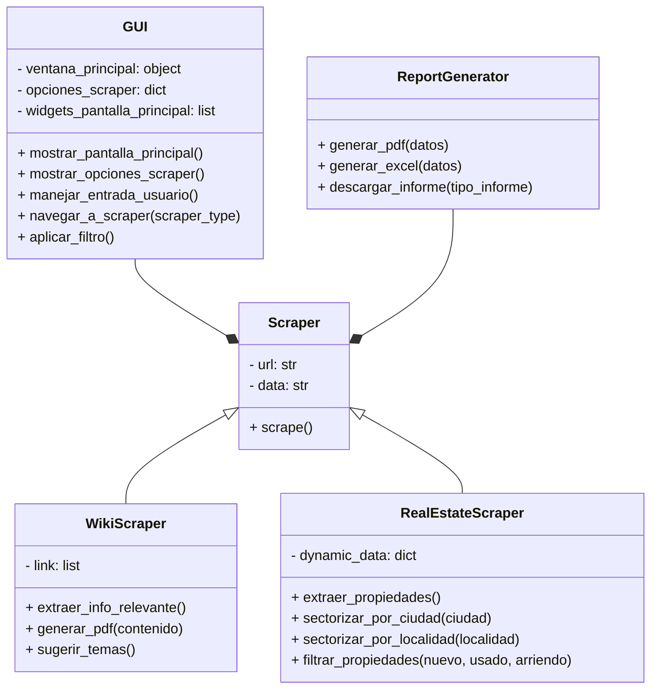

# Data Digger

## Descripción
**Data Digger** es una aplicación de escritorio diseñada para facilitar la extracción de datos de sitios web estáticos y dinámicos. Su principal objetivo es proporcionar herramientas eficientes para procesar información y entregarla en formatos organizados, como PDF o Excel. La aplicación es completamente portable, ya que está empaquetada como un archivo ejecutable (.exe) que no requiere instalación.

---

## Funcionalidades

### 1. Wiki Scraper
Este módulo permite a los usuarios:
- Extraer información relevante de páginas de Wikipedia.
- Generar un archivo PDF con el contenido seleccionado.
- Identificar palabras clave con enlaces a otros artículos relacionados y mostrarlas como recomendaciones.

**Flujo de trabajo:**
1. Introducir la URL de la página de Wikipedia.
2. Procesar el contenido para extraer texto relevante y enlaces.
3. Generar un archivo PDF con los resultados.

### 2. Real State Scraper
Este módulo se enfoca en páginas de bienes raíces y permite:
- Extraer publicaciones según los filtros proporcionados (ciudad, barrio, tipo de inmueble, etc.).
- Generar un archivo Excel con los datos estructurados.
- Buscar automáticamente la mejor opción según los criterios del usuario.

**Flujo de trabajo:**
1. Introducir la URL del sitio de bienes raíces.
2. Configurar los filtros deseados.
3. Generar un archivo Excel con los resultados y resaltar la mejor opción.

---

## Requisitos Técnicos

### Lenguaje de programación:
- **Python**

### Bibliotecas utilizadas:
- `customtkinter` para la interfaz gráfica.
- `Pillow` para la manipulación de imágenes.
- `requests` y `beautifulsoup4` para scraping web.
- `pandas` y `openpyxl` para manipulación de datos en Excel.
- `reportlab` para generación de PDFs.
- `PyInstaller` para empaquetar la aplicación como archivo ejecutable.

---

## Estructura de la Aplicación

```
DATADIGGER/
│
├── main.py       
├── shared_state.py  
├── config_manager.py      
├── scraper/
│   ├── __init__.py       
│   ├── static_scraper.py  
│   └── dynamic_scrapper/
│       ├── scrapy.cfg
│       └── dynamic_scrapper/
│           ├── __init__.py 
│           ├── items.py       
│           ├── middlewares.py 
│           ├── pipelines.py
│           ├── settings.py  
│           └── spiders/
│               ├── __init__.py 
│               ├── fincaraiz.py 
│               ├── metrocuadrado.py 
│               └── properati/
│
├── gui/
│   ├── __init__.py
│   ├── app_gui_start.py
│   ├── DKDE.py
│   ├── gui_blue_theme.py
│   ├── gui_green_theme.py
│   └── gui_red_theme.py       
│
├── reports/
│   ├── __init__.py
│   ├── dynamic_report.py
│   └── static_report.py  
│
└── assets/              
```

---

## Instalación y Uso

1. Descargar el archivo ejecutable (.exe) desde el repositorio.
2. Ejecutar el archivo en cualquier computador con Windows (no requiere instalación).
3. Seguir las instrucciones de la interfaz para seleccionar el módulo deseado y realizar el scraping.

---

## GUI

### Pantalla Principal


### Wiki Scraper


### Real State Scraper


---
## DIAGRAMA DE CLASES

¿Por qué se extinguieron los mamuts? Porque no habian paputs
